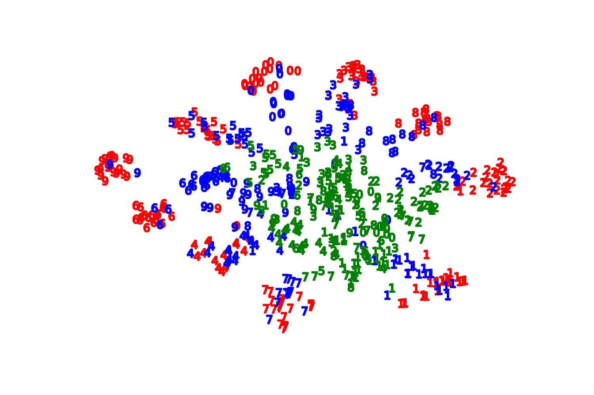

# A Principled Approach for Learning Task Similarity in Multitask Learning
This repo provides the codes for the above-mentioned paper published in IJCAI 2019. Briefly, we revisit the Adversarial Multi-task Neural Network (AMTNN), proposing a new training algorithm to learn the task relation coefficients and neural network parameters iteratively.

## Abstract
Multitask learning aims at solving a set of related tasks simultaneously, by exploiting the shared knowledge for improving the performance on individual tasks. Hence, an important aspect of multitask learning is to understand the similarities within a set of tasks. Previous works have incorporated this similarity information explicitly (e.g., weighted loss for each task) or implicitly (e.g., adversarial loss for feature adaptation), for achieving good empirical performances. However, the theoretical motivations for adding task similarity knowledge are often missing or incomplete. In this paper, we give a different perspective from a theoretical point of view to understand this practice. We first provide an upper bound on the generalization error of multitask learning, showing the benefit of explicit and implicit task similarity knowledge. We systematically derive the bounds based on two distinct **task similarity metrics: H divergence and Wasserstein distance**. From these theoretical results, we revisit the Adversarial Multi-task Neural Network (AMTNN), proposing a new training algorithm to learn the task relation coefficients and neural network parameters iteratively. We assess our new algorithm empirically on several benchmarks, showing not only that we find interesting and robust task relations, but that the proposed approach outperforms the baselines, reaffirming the benefits of theoretical insight in algorithm design.

 t-SNE in the feature space of task MNIST in AMTNN W
for 8K samples. MNIST ,  MNIST-M, and  green : SVHN. As MNIST is more similar to MNIST-M task than SVHN, the samples from these two datasets are palced more nearby in the representation space, learned by our ATMNN.</img>
